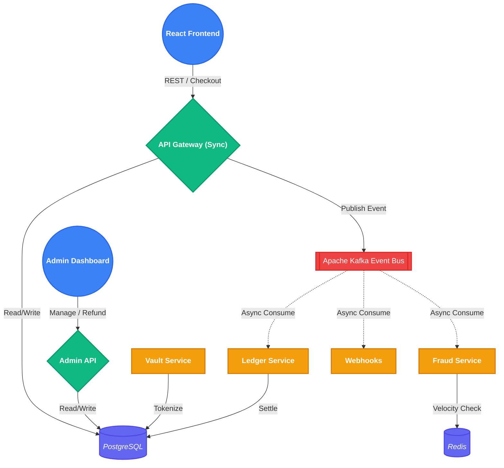
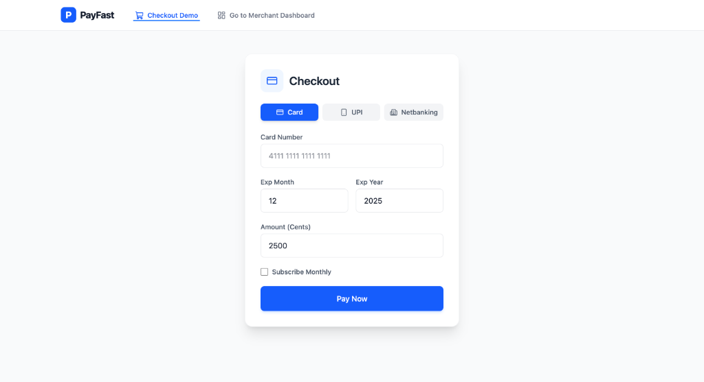
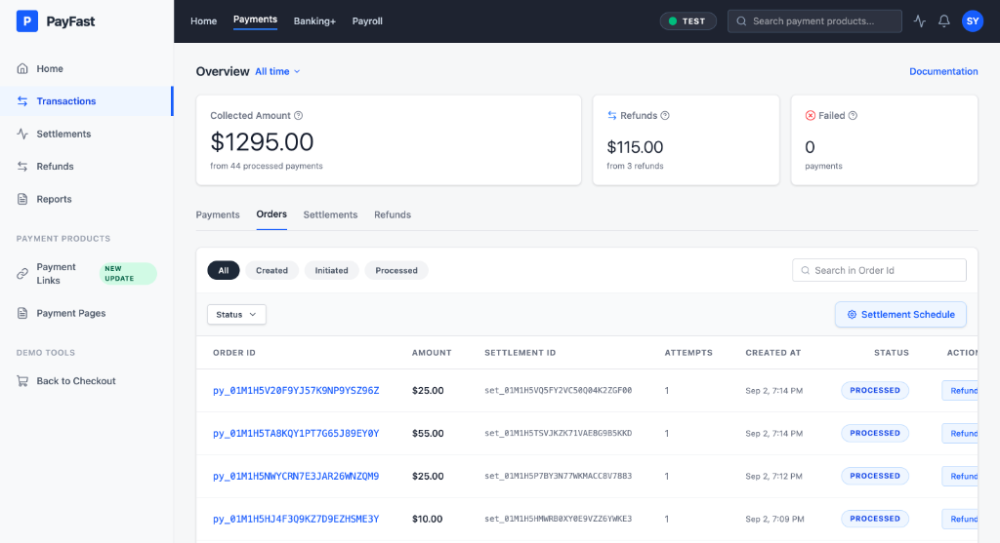
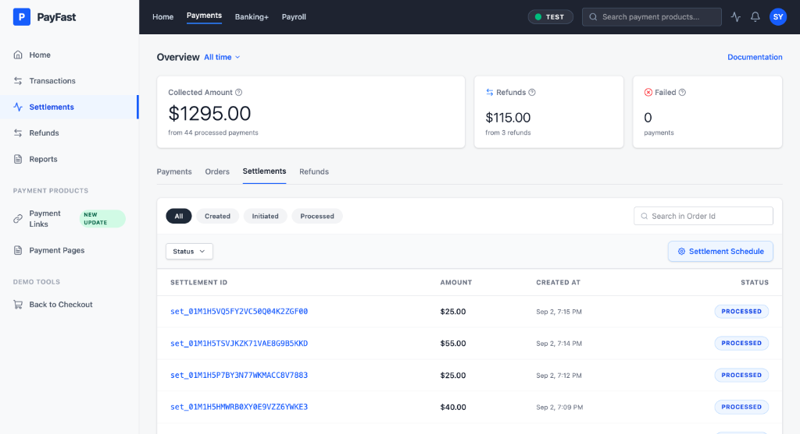
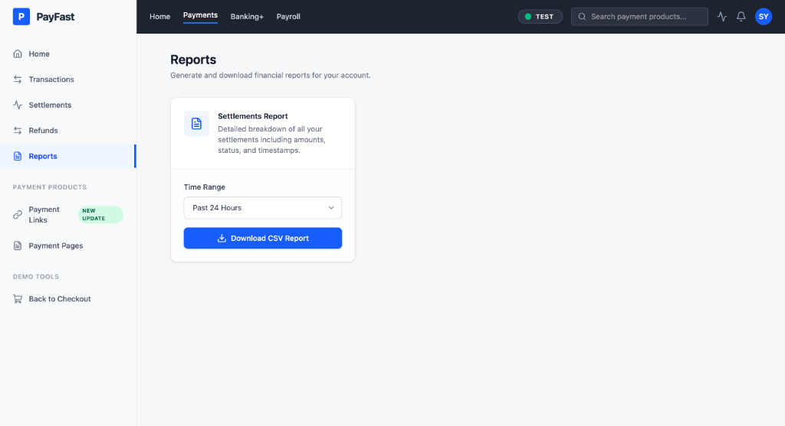

# 💳 PayFast

**Enterprise Payment Processor built with Event-Driven Microservices**

A robust, production-inspired payment processing pipeline that securely tokenizes cards, evaluates real-time fraud risks via velocity checks, settles double-entry accounting ledgers, and manages transactions asynchronously using Apache Kafka.

---

## 🌐 Live Demo

| Component | URL |
| :--- | :--- |
| 💳 **Live Application** | [https://payfast-payment-app.duckdns.org](https://payfast-payment-app.duckdns.org) |
| 📊 **Admin Dashboard** | [https://payfast-payment-app.duckdns.org](https://payfast-payment-app.duckdns.org) *(Click 'Go to Merchant Dashboard')* |

---

## 🚀 Overview

The project emphasizes engineering a **highly reliable, fault-tolerant payment system**, not simply a CRUD application.

Rather than relying solely on synchronous APIs, PayFast combines an API Gateway with an event-driven message broker to produce an eventually-consistent, highly available system. 

Given a checkout request, it automatically:
- 🔒 **Tokenizes** sensitive payment details via the Vault Service.
- ⚡ **Evaluates** real-time fraud velocity using Redis.
- 📝 **Records** double-entry bookkeeping ledgers.
- 🔄 **Prevents** double charges using Idempotency keys.
- 📊 **Exposes** back-office operations via an Admin API and React Dashboard.

---

## ✨ Features

- **Asynchronous Event-Driven Architecture**
- **Idempotency (Duplicate Payment Prevention)**
- **Redis-Backed Velocity Fraud Detection**
- **PCI-DSS Inspired Vault Tokenization**
- **Double-Entry Ledger Accounting**
- **Admin Dashboard & Analytics**
- **Graceful Error Recovery & Retries**
- **Full Docker & Docker Compose Support**

---

## 🏗️ Architecture

### Pipeline Overview
1. The **React Frontend** sends a checkout payload with an Idempotency-Key.
2. The **API Gateway** creates the payment synchronously and prevents duplicates.
3. The Gateway publishes a `PaymentEvent` to **Apache Kafka**.
4. The **Fraud Service** consumes the event and evaluates risk using **Redis**.
5. The **Ledger Service** consumes the event and settles merchant accounts.

### Architecture Diagram



## 📸 Screenshots

Here is a look at the Checkout and Merchant Dashboard interfaces:

| Customer Checkout | Transactions / Orders |
| :---: | :---: |
|  |  |

| Settlements & Payouts | Refunds Management |
| :---: | :---: |
|  |  |

| Analytics & Reports |
| :---: |
|  |

---

## 📂 Project Structure

```text
Payment_Processor
├── frontend/                 # React UI Dashboard & Checkout
│   ├── src/
│   │   ├── components/
│   │   └── App.tsx
│   └── package.json
├── services/                 # Backend Go Microservices
│   ├── admin_api/            # Back-office API
│   ├── fraud/                # Redis Velocity checking service
│   ├── gateway/              # Main ingress for checkouts
│   ├── ledger/               # Accounting and settlements
│   ├── subscriptions/        # Recurring billing engine
│   └── vault/                # Secure tokenization
├── migrations/               # PostgreSQL Database Schemas
├── docker-compose.yml        # Orchestration
└── README.md                 # You are here
```

---

## 🛠️ Tech Stack

| Layer | Technology |
| --- | --- |
| **Language** | Go 1.20+, TypeScript |
| **Frontend** | React, Tailwind CSS, Vite |
| **Database** | PostgreSQL |
| **Cache/Rate Limiting** | Redis |
| **Message Broker** | Apache Kafka & Zookeeper |
| **Infrastructure** | Docker, Docker Compose |

---

## ⚙️ Local Setup

### 1. Clone the repository
```bash
git clone <repository-url>
cd Payment_Processor
```

### 2. Run the Backend Infrastructure (Docker)
The easiest way to start all Go microservices, Kafka, Redis, and Postgres is via Docker Compose:
```bash
docker-compose up -d --build
```
*Wait a few seconds for Kafka and Postgres to properly initialize.*

### 3. Run the Frontend (Local Dev)
```bash
cd frontend
npm install
npm run dev
```
Navigate to `http://localhost:5173` in your browser.

---

## 🤝 Contributing

PayFast is an open-source personal project designed to showcase scalable architecture.
Feel free to:
- ⭐ Star the repository
- 🍴 Fork it
- 🛠️ Build on top of it
- 💡 Share feedback or ideas

---

## 📄 License

This project is licensed under the MIT License.
