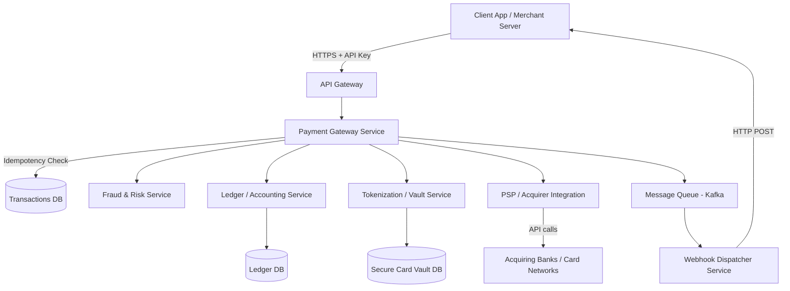

# System Design: Payment System (like Stripe)

Designing a payment system like Stripe is a complex task that requires handling money with absolute precision, high security, and high availability. Here is a comprehensive system design for a payment gateway.

## 1. Requirements

### Functional Requirements
*   **Process Payments:** Charge a customer's credit card or alternative payment methods.
*   **Tokenization (Vault):** Securely store sensitive credit card information and return a non-sensitive token to the merchant.
*   **Payouts:** Transfer collected funds to the merchant's bank account.
*   **Webhooks:** Asynchronously notify merchants about payment status changes (e.g., `payment_intent.succeeded`).
*   **Idempotency:** Ensure that retrying a failed or timed-out request does not result in a double charge.

### Non-Functional Requirements
*   **High Availability (99.999%):** The system must always be up; downtime means lost revenue.
*   **Consistency:** Strong consistency (ACID properties) is non-negotiable for financial transactions.
*   **Security & Compliance:** Must be PCI-DSS compliant. Sensitive data must be encrypted at rest and in transit.
*   **Scalability:** Must handle spikes in traffic (e.g., Black Friday).
*   **Low Latency:** Fast transaction processing to ensure a good user experience.

---

## 2. High-Level Architecture



### Core Components

1.  **API Gateway:**
    *   Acts as the single entry point.
    *   Handles authentication (API keys), rate limiting, and request validation.
    *   SSL termination.

2.  **Payment Gateway Service:**
    *   The orchestrator of the payment flow.
    *   Generates a unique `Transaction ID`.
    *   Coordinates between the Fraud service, Ledger, Vault, and Bank integrations.

3.  **Tokenization / Vault Service (CDE - Card Data Environment):**
    *   This is the *only* component that touches raw credit card numbers (PAN).
    *   It securely encrypts the PAN, stores it, and returns a UUID (Token) to the Payment Gateway.
    *   Strict network isolation and compliance with PCI-DSS.

4.  **Risk & Fraud Detection Service:**
    *   Uses rule-based engines and Machine Learning models to score the transaction.
    *   Analyzes IP address, velocity of transactions, user history, etc.
    *   Can synchronously block high-risk transactions.

5.  **Ledger / Accounting Service:**
    *   The source of truth for all financial movements.
    *   Uses **Double-Entry Bookkeeping** (every transaction consists of at least one debit and one credit that must sum to zero).
    *   Ensures funds are correctly allocated to the merchant account, Stripe's fee account, etc.

6.  **PSP Integrator / Acquirer Network Service:**
    *   Translates internal payment requests into the specific formats required by external payment processors, acquiring banks, or card networks (Visa, Mastercard).

7.  **Webhook / Notification Service:**
    *   Payments can fail or succeed asynchronously.
    *   This service reads events from a message queue (like Kafka) and securely POSTs the status back to the merchant's configured webhook endpoints. Includes retry mechanisms with exponential backoff.

---

## 3. The Payment Flow (Step-by-Step)

1.  **Checkout:** The end-user enters their credit card on the merchant's checkout page (usually via a secure UI component like Stripe Elements).
2.  **Tokenization:** The UI sends the raw card details directly to Stripe's **Tokenization Service**. The merchant *never* sees the raw card data.
3.  **Token Returned:** The Vault stores the card, returns a token (e.g., `tok_12345`), and the UI submits this token to the merchant's backend.
4.  **Charge Request:** The merchant's backend calls the Payment API with the token, amount, currency, and an `Idempotency-Key`.
5.  **Idempotency Check:** The **Payment Gateway** checks the database to see if this `Idempotency-Key` has been processed before. If yes, it returns the cached response.
6.  **Fraud Check:** The transaction is evaluated by the **Risk Service**.
7.  **Authorization:** The **PSP Integrator** sends the token (translated back to PAN securely) and amount to the Card Network for authorization (checking if the user has enough funds).
8.  **Ledger Entry:** If authorized, the **Ledger** records the pending transaction.
9.  **Capture:** The funds are actually captured (often done simultaneously with authorization in a single-message system). The Ledger updates the status to `succeeded`.
10. **Response & Webhook:** The Payment Gateway responds `200 OK` to the merchant, and simultaneously fires a `payment_intent.succeeded` event to the message queue for the Webhook Service to deliver.

---

## 4. Key Technical Design Decisions

### Idempotency (Crucial)
Network requests can fail or time out. If a merchant gets a timeout, they might retry the request. To prevent charging the user twice, every API request requires an `Idempotency-Key` (a UUID generated by the merchant).
*   The Payment Gateway checks a fast key-value store (like Redis) or a database table `idempotency_keys`.
*   If the key exists and the transaction succeeded, it returns the exact same successful response.
*   If the key exists and the transaction is *in progress*, it waits or returns a `409 Conflict`.

### Distributed Transactions & Consistency
Payment systems cannot use eventual consistency for core money movements.
*   **Saga Pattern:** Since communicating with external banks and internal services takes time, a Saga pattern is often used. If a step fails (e.g., bank rejects), compensating transactions are fired to rollback any internal ledger entries.
*   **Database:** Relational databases with strong ACID guarantees (like PostgreSQL, AWS Aurora, or distributed SQL like CockroachDB/Spanner) are preferred for the Ledger and Transactions tables.

### Double-Entry Bookkeeping
Instead of just storing `merchant_balance = 100`, the ledger stores immutable records of debits and credits.
For a $100 payment with a $3 fee:
*   `CREDIT` Merchant Account: $97
*   `CREDIT` Stripe Revenue Account: $3
*   `DEBIT` Transit Account (Funds pending from Bank): $100
*   *Sum of transaction = $0*

### Secure Card Vault (PCI-DSS)
*   The Tokenization Vault must be in a highly isolated subnet.
*   No internet access out; highly restricted access in.
*   Data is encrypted at rest using strong algorithms (AES-256) and keys managed by an HSM (Hardware Security Module) or Key Management Service (KMS).

## 5. Database Schema (Simplified)

```sql
CREATE TABLE payments (
    id VARCHAR(255) PRIMARY KEY,
    merchant_id VARCHAR(255),
    amount INTEGER, -- Store in cents/smallest unit to avoid floating point errors
    currency VARCHAR(3),
    token_id VARCHAR(255),
    status VARCHAR(50), -- 'pending', 'authorized', 'captured', 'failed'
    idempotency_key VARCHAR(255) UNIQUE,
    created_at TIMESTAMP
);

CREATE TABLE ledger_entries (
    id VARCHAR(255) PRIMARY KEY,
    transaction_id VARCHAR(255),
    account_id VARCHAR(255),
    amount INTEGER, -- Positive for credit, Negative for debit
    currency VARCHAR(3),
    created_at TIMESTAMP
);
```

## 6. Scalability Bottlenecks & Solutions

*   **Database Contention on Ledger:** Updating the same merchant's balance concurrently can cause row locks. *Solution:* Use event sourcing to append ledger entries, and asynchronously calculate balances using materialized views or a separate balance calculation service.
*   **Third-Party Latency:** External bank APIs are often slow and unreliable. *Solution:* Implement robust circuit breakers, timeouts, and asynchronous processing where applicable. Decouple internal processing from synchronous bank calls.

## 7. Dashboard & Reporting Architecture (CQRS)

When building the Frontend Dashboards (Merchant Dashboard & Settlement Dashboard), directly querying the core transactional (OLTP) databases for aggregations (like "total revenue this month") is an anti-pattern. It would slow down real-time payment processing.

To handle this, we use the **CQRS (Command Query Responsibility Segregation)** pattern:
*   **Event Consumers:** The same events we pushed to Kafka (e.g., `payment_intent.succeeded`, `charge.refunded`) are consumed by a dedicated **Reporting Service**.
*   **Read-Optimized Database (OLAP):** The Reporting Service writes data into databases optimized for reading and analytics. 
    *   **Elasticsearch** is used for fast, paginated text searches (e.g., searching for a specific customer email or transaction ID).
    *   **ClickHouse / Snowflake / Redshift** is used for heavy aggregations (e.g., calculating daily settlement totals).
*   **Decoupled Frontend:** The Merchant Dashboard calls read-only APIs that fetch data from these OLAP databases, ensuring that even if thousands of merchants are downloading CSV reports, the core payment gateway remains unaffected.

## 8. Payouts & Settlement System

To actually transfer money to the merchant's bank account, the system requires a dedicated **Payout / Settlement Service**. 

### How Settlements Work
1. **Merchant Preferences:** Every merchant configures a payout schedule (e.g., Daily, Weekly, Monthly) and a settlement delay (e.g., T+2 days, meaning transactions from Tuesday are paid out on Thursday).
2. **Cron Scheduler:** A distributed task scheduler (like Temporal, Celery, or AWS EventBridge) runs periodically (usually midnight UTC) and checks which merchants are due for a payout.
3. **Aggregation:** The Payout Service queries the Ledger DB to aggregate all `succeeded` payments that have crossed the T+2 window for a specific merchant. It also subtracts any refunds, chargebacks, and platform processing fees.
4. **Ledger Update:** The system creates a new entry in the Ledger:
   * `DEBIT` Merchant Payable Account
   * `CREDIT` Bank Payout Transit Account
5. **Bank API Call:** The Payout Service connects to the banking network (via ACH, NEFT, RTGS, or SEPA depending on the country) to execute the actual wire transfer to the merchant's real-world bank account.
6. **Status Webhook:** Once the bank confirms the transfer (which can take hours or days), a `payout.paid` event is pushed to Kafka, which updates the Settlement Dashboard and sends an email/webhook to the merchant.

## 9. Supported Payment Methods (Omnichannel Routing)

To be a versatile payment gateway (especially in markets like India), the system must support multiple payment methods beyond just credit/debit cards. The **Payment Gateway Service** uses a *Strategy Pattern* or a *Routing Engine* to handle different payment flows:

### 1. Cards (Credit / Debit)
*   **Flow:** Uses the Tokenization Vault.
*   **Integration:** Routes to Card Networks (Visa, Mastercard, RuPay) via Acquirer Banks.
*   **Security:** Requires PCI-DSS compliance, CVV validation, and 3D Secure (OTP) authentication.

### 2. UPI (Unified Payments Interface)
*   **Flow:** Does not require the Card Vault. Uses Virtual Payment Addresses (VPAs) like `user@upi` or Dynamic QR Codes.
*   **Integration:** Connects to UPI switches (like NPCI in India) via banking partners (e.g., YES Bank, ICICI).
*   **Mechanisms:**
    *   **UPI Collect:** System sends a payment request to the user's UPI app.
    *   **UPI Intent:** Opens the UPI app directly on the user's mobile device.
    *   **Dynamic QR:** Generates a unique QR code on the checkout page for the exact amount.

### 3. Netbanking
*   **Flow:** Redirects the user from the checkout page to their specific bank's secure login portal.
*   **Integration:** Connects to aggregators or direct bank APIs (HDFC, SBI, Axis, etc.).
*   **Mechanism:** Synchronous redirect flow. After the user logs into their bank and approves the payment, the bank redirects them back to our `return_url` with a success/failure token, which our Webhook Service verifies.
